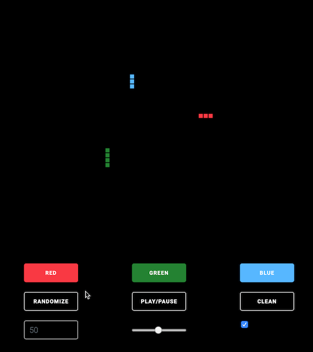

# gameoflife.io

A front made with Vue.js that render a Game Of Life calculated on a Kuzzle backend.

## Usage

### Prerequisite:

You need to run the Kuzzle server that can be found here : https://github.com/bilouw/kuzzle-core-plugin-gameoflife
to retrieve the grid data.

### DEV mode:
From a terminal :

* `git clone https://github.com/bilouw/gameoflife.io.git`
* `cd gameoflife.io`
* `npm install`
* `npm run dev`
